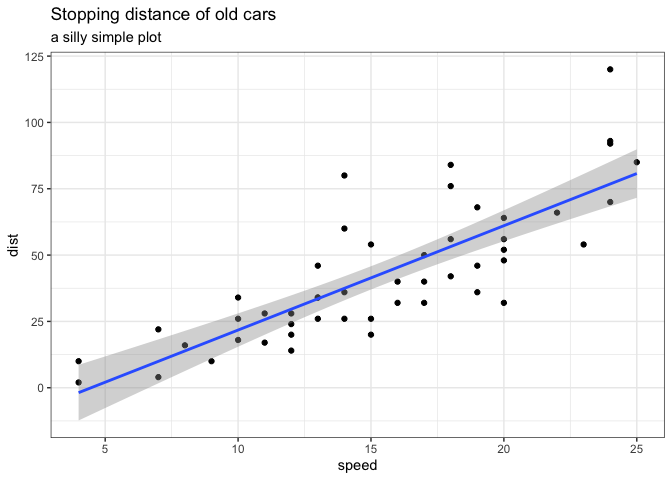
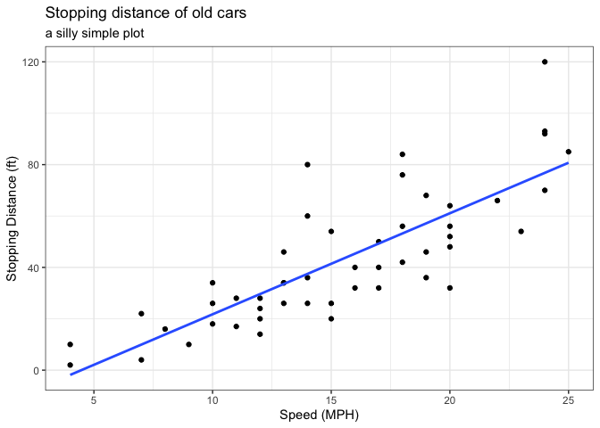
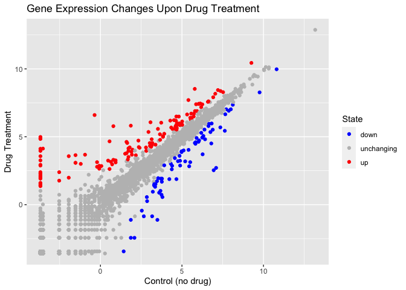
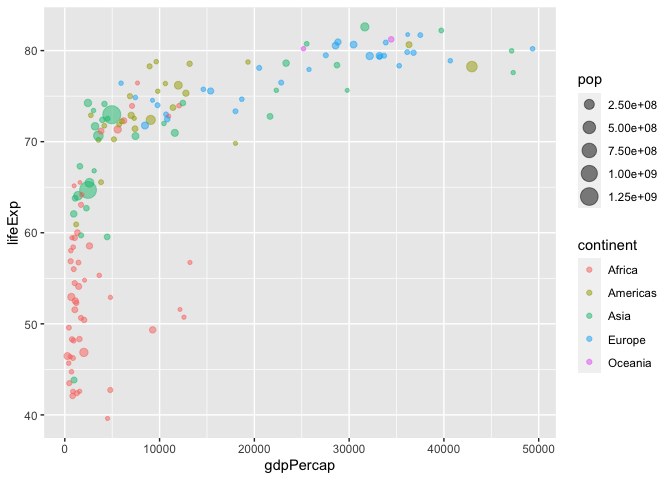
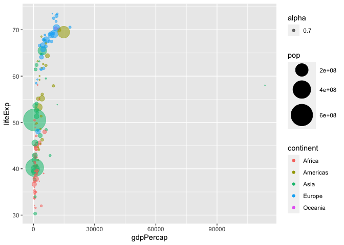
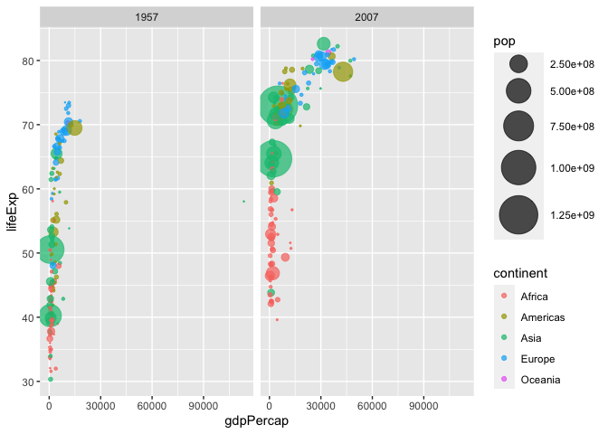

# Class 05: Data Visualization
Laurie Chang A16891192

# Graphics systems in R

There are many graphics systems in R for making plots and figures.

We have already played a little with **base R** graphics and the
`plot()` function.

Today, we will start learning about a popular graphics package called
`ggplot2()`.

This is an add on package - i.e. we need to install it. I install it
(like I install any packing) with `install.package()` function.

``` r
plot(cars)
```


Before I can use the functions from a package, I have to load up the
package from my “library”. We use the `library(ggplot2)` command to load
it up.

``` r
library(ggplot2)
ggplot(cars)
```


Every ggplot is made up of at least 3 things:

- data (the numbers, etc. that will go into your plot)

- aesthetics (aes) (how the columns of data map to the plot aesthetics)

- geometries (geoms) (how the plot actually looks: points, bars, lines,
  etc.)

``` r
ggplot(cars) +
  aes(x=speed, y=dist) +
  geom_point()
```


For simple plots, ggplot is more verbose- it takes more code - than base
R plot.

Add some more layers to our ggplot:

``` r
ggplot(cars) +
  aes(x=speed, y=dist) +
  geom_point() +
  geom_smooth(method= "lm") +
  labs(title="Stopping distance of old cars", subtitle= "a silly simple plot") +
  theme_bw()
```

    `geom_smooth()` using formula = 'y ~ x'



``` r
ggplot(cars) +
  aes(x=speed, y=dist) +
  geom_point() +
  geom_smooth(method= "lm", se = FALSE) +
  labs(title="Stopping distance of old cars", 
       subtitle= "a silly simple plot",
       x = "Speed (MPH)",
       y = "Stopping Distance (ft)") +
  theme_bw()
```

    `geom_smooth()` using formula = 'y ~ x'



\#Adding more plot aesthetics through `aes()`

``` r
url <- "https://bioboot.github.io/bimm143_S20/class-material/up_down_expression.txt"
genes <- read.delim(url)

nrow(genes)
```

    [1] 5196

``` r
colnames(genes)
```

    [1] "Gene"       "Condition1" "Condition2" "State"     

``` r
ncol(genes)
```

    [1] 4

``` r
table(genes$State)
```


          down unchanging         up 
            72       4997        127 

``` r
round(127/5196, 4)*100
```

    [1] 2.44

``` r
round((table(genes$State)/nrow(genes))*100, 2)
```


          down unchanging         up 
          1.39      96.17       2.44 

Basic scatterplot

``` r
ggplot(genes)+
  aes(x =Condition1, y = Condition2)+
  geom_point()
```


``` r
p <- ggplot(genes)+
  aes(x =Condition1, y = Condition2, col=State)+
  geom_point()
```

``` r
p + scale_color_manual(values= c("blue","gray", "red"))
```


``` r
p + scale_color_manual(values= c("blue","gray", "red")) +
  labs(title = "Gene Expression Changes Upon Drug Treatment", 
       x = "Control (no drug)",
       y = "Drug Treatment")
```



## Going Further

``` r
url <- "https://raw.githubusercontent.com/jennybc/gapminder/master/inst/extdata/gapminder.tsv"

library(dplyr)
```


    Attaching package: 'dplyr'

    The following objects are masked from 'package:stats':

        filter, lag

    The following objects are masked from 'package:base':

        intersect, setdiff, setequal, union

``` r
gapminder <- read.delim(url)
gapminder_2007 <- gapminder %>% filter(year==2007)
```

``` r
ggplot(gapminder_2007) +
  aes(x = gdpPercap, y = lifeExp) +
  geom_point()
```


``` r
ggplot(gapminder_2007) +
  aes(x = gdpPercap, y = lifeExp) +
  geom_point(alpha = 0.5)
```


adding more variables to `aes()`

mapping the `continent` variable to point `color` aesthetic and the
population `pop` (in millions) through the point `size` argument to
`aes()`

plot includes 4 different variables from data set

``` r
ggplot(gapminder_2007) +
  aes(x = gdpPercap, y = lifeExp, color = continent, size = pop) +
  geom_point(alpha = 0.5)
```



color the points by the numeric variable popularion pop

``` r
ggplot(gapminder_2007) + 
  aes(x = gdpPercap, y = lifeExp, color = pop) +
  geom_point(alpha=0.8)
```


- now a continuous scale as seen in legend

- light blue points now the countries with the highest population
  number(China and India)

Adjusting point size

``` r
ggplot(gapminder_2007) + 
  aes(x = gdpPercap, y = lifeExp, size = pop) +
  geom_point(alpha=0.5)
```


- point sizes in the plot do not clearly reflect the population
  differences in each country (sizes are not proportional)

- point sizes binned by default

``` r
ggplot(gapminder_2007) + 
  geom_point(aes(x = gdpPercap, y = lifeExp,
                 size = pop), alpha=0.5) + 
  scale_size_area(max_size = 10)
```


1957 plot

``` r
gapminder_1957 <- gapminder %>% filter(year==1957)
ggplot(gapminder_1957)+
  geom_point(aes(x = gdpPercap, y= lifeExp, color= continent, size = pop, alpha = 0.7)) +
  scale_size_area(max_size = 15)
```



``` r
gapminder_combined <- gapminder %>% filter(year==1957 | year==2007)
ggplot(gapminder_combined)+
  geom_point(aes(x = gdpPercap, y= lifeExp, color= continent, size = pop), alpha = 0.7) +
  scale_size_area(max_size = 15) +
  facet_wrap(~year)
```


